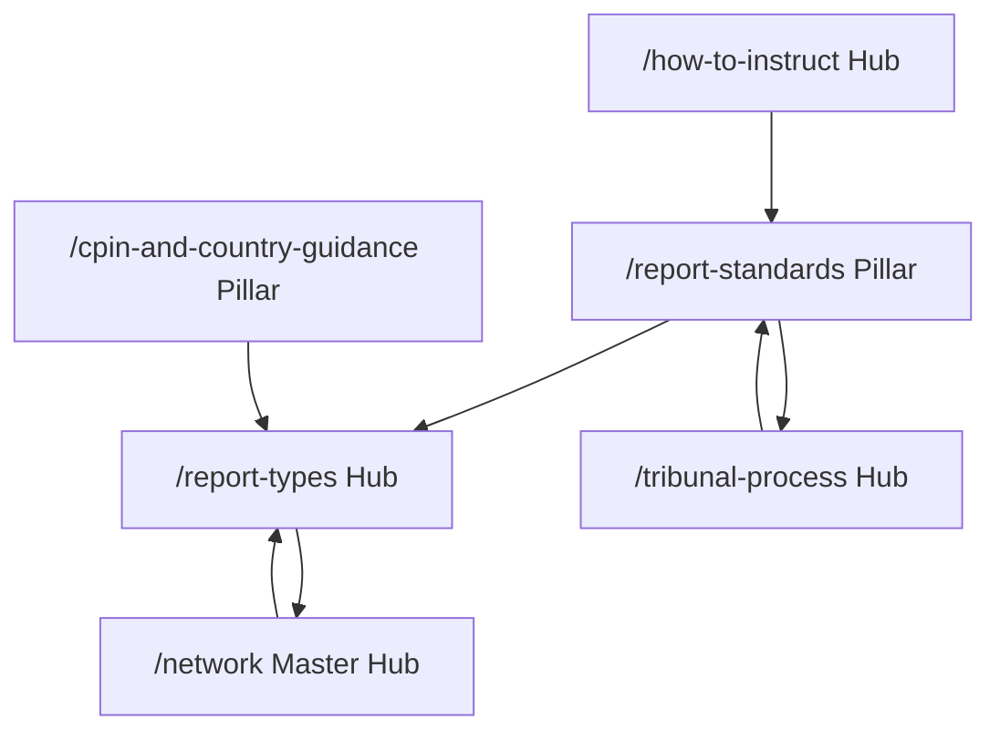
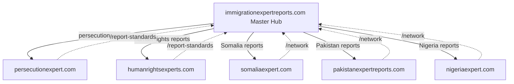
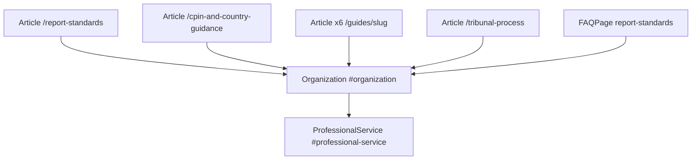

# SEO Architecture — immigrationexpertreports.com

**Canonical domain:** `https://www.immigrationexpertreports.com`  
**Site name:** Immigration Expert Reports  
**Locale:** `en_GB` (UK immigration solicitors, tribunal practitioners, Legal Aid)  
**Role:** Network master hub (report standards, instruction process, report taxonomy, tribunal procedure — NOT country-specific asylum profiles)

This document is the single source of truth for keyword strategy, network positioning, content clusters, internal linking, GEO (Generative Engine Optimization), off-page SEO, schema architecture, and launch deployment for immigrationexpertreports.com. All slugs and URLs align with the canonical build-spec naming convention.

**Implementation status:** Implemented in this repository (June 2026). Run `npm run seo:generate && npm run seo:verify` after content or route changes.

**Related files (future):** `data/network-sites.ts`, `data/report-types.ts`, `data/guides.ts`, `data/case-types.ts`, `data/glossary.ts`, `data/related-links.ts`, `lib/metadata.ts`, `lib/seo/publicUrlInventory.ts`, `scripts/generate-seo.ts`, `scripts/verify-seo.ts`

---

## 1. Keyword Strategy

### Cannibalisation routing (master hub rule)

immigrationexpertreports.com owns **generic** immigration expert report queries, **report standards**, **instruction process**, **report taxonomy**, and **tribunal procedure**. It does **not** compete for country-specific, persecution-ground, or human-rights-violation keywords — those route to network sites.

| Keyword theme | Primary URL on IER | Outbound route |
|---------------|-------------------|----------------|
| Generic immigration expert reports | `/`, `/report-standards`, `/what-is-an-immigration-expert-report` | — |
| Persecution / internal relocation | `/report-types/persecution-analysis-reports` (taxonomy only) | [persecutionexpert.com](https://www.persecutionexpert.com) |
| Human rights expert reports | `/report-types/human-rights-violation-reports` (taxonomy only) | [humanrightsexperts.com](https://www.humanrightsexperts.com) |
| Country condition / country expert | `/report-types/country-condition-reports`, `/network` | Country sites (Somalia, Pakistan, Nigeria, etc.) |
| CPIN / country guidance | `/cpin-and-country-guidance`, `/report-types/cpin-challenge-reports` | Country sites for country-specific CPIN content |

### Tier 1 — Transactional

**Target pages:** homepage, report types, tribunal process, how-to-instruct, qualifications, contact.

| Keyword | Primary URL |
|---------|-------------|
| immigration expert reports UK | `/`, `/report-standards` |
| immigration expert report tribunal | `/tribunal-process`, `/qualifications` |
| asylum expert report UK | `/report-types`, `/network` |
| country expert report immigration UK | `/report-types/country-condition-reports`, `/network` |
| immigration tribunal expert report | `/tribunal-process`, `/` |
| Legal Aid immigration expert report UK | `/how-to-instruct`, `/guides/instructing-expert-legal-aid` |
| country condition expert report UK | `/report-types/country-condition-reports` |
| persecution expert report asylum UK | `/report-types/persecution-analysis-reports` → outbound to persecutionexpert.com |
| human rights expert report immigration UK | `/report-types/human-rights-violation-reports` → outbound to humanrightsexperts.com |
| CPIN challenge expert report UK | `/report-types/cpin-challenge-reports`, `/cpin-and-country-guidance` |

### Tier 2 — Informational

**Target pages:** report standards pillar, report types, guides, glossary, how-reports-work, cpin-and-country-guidance.

| Keyword | Primary URL |
|---------|-------------|
| immigration expert report standards 2025 | `/report-standards`, `/guides/immigration-expert-report-standards-guide` |
| Practice Direction expert evidence 2024 | `/report-standards#practice-direction-2024`, `/glossary#practice-direction-expert-evidence` |
| Adam Pipe expert reports immigration 2025 | `/report-standards#adam-pipe-2025`, `/glossary#adam-pipe-guide-october-2025` |
| CPR Part 35 immigration expert reports | `/guides/cpr-part-35-immigration-expert-reports` |
| what is an immigration expert report | `/what-is-an-immigration-expert-report` |
| letter of instruction expert report UK | `/guides/letter-of-instruction-guide`, `/how-to-instruct` |
| CPIN vs country guidance expert | `/guides/cpin-vs-country-guidance-guide`, `/cpin-and-country-guidance` |
| internal relocation expert report UK | `/report-types/persecution-analysis-reports` → outbound to persecutionexpert.com `/expertise-areas/internal-relocation` |
| choosing immigration expert report type | `/guides/choosing-the-right-expert`, `/report-types` |
| LAA prior authority expert report | `/guides/instructing-expert-legal-aid`, `/how-to-instruct` |

### Tier 3 — Long-tail

**Target pages:** report standards, tribunal process, guides, glossary, report types.

| Keyword | Primary URL(s) |
|---------|----------------|
| immigration expert report 20 page limit | `/report-standards#practice-direction-2024`, `/how-reports-work` |
| Adam Pipe October 2025 expert report guide | `/report-standards#adam-pipe-2025`, `/glossary#adam-pipe-guide-october-2025` |
| late expert evidence immigration tribunal | `/tribunal-process/late-expert-evidence` |
| single joint expert immigration asylum | `/tribunal-process/single-joint-experts` |
| hot-tubbing expert evidence immigration | `/tribunal-process/hot-tubbing-concurrent-evidence` |
| country condition vs persecution expert UK | `/guides/choosing-the-right-expert`, `/report-types` |
| human rights vs persecution expert report | `/guides/choosing-the-right-expert#human-rights-vs-persecution` |
| instructing expert witness Legal Aid asylum | `/guides/instructing-expert-legal-aid`, `/how-to-instruct` |
| FTT asylum expert report exchange deadline | `/tribunal-process/ftt-asylum-appeals` |
| Upper Tribunal expert report country guidance | `/tribunal-process/upper-tribunal` |
| Ikarian Reefer immigration expert duty | `/report-standards`, `/glossary#ikarian-reefer` |
| OSCOLA expert report immigration tribunal | `/report-standards`, `/glossary#oscola-expert-report` |

### Keyword → URL implementation reference

| Cluster | URL pattern | Meta source |
|---------|-------------|-------------|
| Brand / transactional | `/` | Page-level `createMetadata()` |
| Definition / GEO pillar | `/what-is-an-immigration-expert-report` | Page-level metadata |
| Report standards pillar | `/report-standards` | Page-level metadata + section anchors |
| Report type transactional | `/report-types/{slug}` | `data/report-types.ts` |
| Tribunal procedural | `/tribunal-process/{slug}` | Page-level metadata or `data/tribunal-process.ts` |
| CPIN pillar | `/cpin-and-country-guidance` | Page-level metadata + section anchors |
| Case-type transactional | `/case-types/{slug}` | `data/case-types.ts` |
| Informational guides | `/guides/{slug}` | `data/guides.ts` |
| Process / standards | `/how-reports-work`, `/how-to-instruct`, `/qualifications` | Page-level metadata |
| Network hub | `/network` | `data/network-sites.ts` |
| Services | `/services`, `/services/{id}` | `data/services.ts` (if implemented) |

**Route note:** `/what-is-an-immigration-expert-report` is the canonical definition URL. Legacy `/what-is-an-immigration-expert-witness` 301-redirects to it (see Appendix F).

---

## 2. Unique Content Assets

1. **`/report-standards` pillar** — most comprehensive immigration expert report standards guide in the network (Practice Direction 2024 + Adam Pipe October 2025 + CPR Part 35). Primary GEO citation target and reciprocal link destination for all network sites.

2. **`/network` master directory** — unique hub role listing all thematic and country sites with descriptive cards. Targets "immigration expert reports network" and routes country/thematic queries without publishing country content on this domain.

3. **`/report-types` taxonomy hub** — report type classification with outbound routing to specialist sites. Prevents keyword cannibalisation while capturing transactional "what type of report do I need" queries.

4. **`/tribunal-process` procedural hub** — FTT, UT, SJE, hot-tubbing, late evidence. Procedural content unique to this domain; no equivalent depth on country or thematic sites.

5. **`/cpin-and-country-guidance` pillar** — CPIN vs Country Guidance hierarchy for solicitors instructing experts. Supports Tier 1 CPIN challenge and Tier 2 informational queries.

6. **`/guides/choosing-the-right-expert` decision framework** — report-type decision tree linking taxonomy to network sites. GEO target for "country condition vs persecution expert" and "human rights vs persecution expert" comparisons.

---

## 3. Content Clusters

Six hubs drive internal linking, anchor text, and content depth. Hub 1 (report standards) is the master pillar connecting all spokes.



### Hub 1: Report Standards

| Role | URL |
|------|-----|
| Pillar | `/report-standards` |
| Guide | `/guides/immigration-expert-report-standards-guide` |
| Guide | `/guides/cpr-part-35-immigration-expert-reports` |
| Process spoke | `/how-reports-work` |
| Glossary | `/glossary#practice-direction-expert-evidence`, `/glossary#adam-pipe-guide-october-2025`, `/glossary#ikarian-reefer` |

**Required anchors on `/report-standards`:**

| Anchor ID | Content |
|-----------|---------|
| `practice-direction-2024` | Practice Direction on expert evidence 2024; 20-page default limit; permission process |
| `adam-pipe-2025` | Adam Pipe October 2025 guide summary for immigration expert reports |
| `cpr-part-35` | CPR Part 35 duties; link to full guide |
| `report-structure` | Numbered expert report structure (qualifications, sources, analysis, opinion, statement of truth) |
| `oscola-citation` | OSCOLA citation standards for tribunal expert reports |

### Hub 2: Report Types

| Role | URL |
|------|-----|
| Hub | `/report-types` |
| Spoke | `/report-types/country-condition-reports` → `/network` (country sites) |
| Spoke | `/report-types/persecution-analysis-reports` → persecutionexpert.com |
| Spoke | `/report-types/human-rights-violation-reports` → humanrightsexperts.com |
| Spoke | `/report-types/cpin-challenge-reports` → `/cpin-and-country-guidance` |
| Decision guide | `/guides/choosing-the-right-expert` |

### Hub 3: Instruction Process

| Role | URL |
|------|-----|
| Hub | `/how-to-instruct` |
| Guide | `/guides/instructing-expert-legal-aid` |
| Guide | `/guides/letter-of-instruction-guide` |
| Qualifications | `/qualifications` |
| Fees | `/fees` |
| Contact | `/contact` |
| Standards link | `/report-standards` |

### Hub 4: CPIN and Country Guidance

| Role | URL |
|------|-----|
| Pillar | `/cpin-and-country-guidance` |
| Guide | `/guides/cpin-vs-country-guidance-guide` |
| Report type | `/report-types/cpin-challenge-reports` |
| Case type | `/case-types/country-guidance-challenges` |
| Glossary | `/glossary#cpin`, `/glossary#country-guidance` |

**Required anchors on `/cpin-and-country-guidance`:**

| Anchor ID | Content |
|-----------|---------|
| `cpin-hierarchy` | CPIN status and weight in tribunal proceedings |
| `country-guidance-hierarchy` | Country Guidance (CG) decisions and binding effect |
| `cpin-vs-cg` | Comparison table: when to challenge CPIN vs rely on CG |
| `expert-role-cpin` | Expert's role in CPIN challenge evidence |

### Hub 5: Tribunal Procedure

| Role | URL |
|------|-----|
| Hub | `/tribunal-process` |
| Spoke | `/tribunal-process/ftt-asylum-appeals` |
| Spoke | `/tribunal-process/upper-tribunal` |
| Spoke | `/tribunal-process/late-expert-evidence` |
| Spoke | `/tribunal-process/single-joint-experts` |
| Spoke | `/tribunal-process/hot-tubbing-concurrent-evidence` |
| Standards link | `/report-standards` |

### Hub 6: Network Routing

| Role | URL |
|------|-----|
| Master hub | `/network` |
| Decision guide | `/guides/choosing-the-right-expert` |
| Definition | `/what-is-an-immigration-expert-report` |
| Taxonomy | `/report-types` (each page links OUT to relevant network site) |

### Report type minimum links matrix

| Report type slug | Outbound network target | Required internal paths |
|------------------|------------------------|-------------------------|
| `country-condition-reports` | Country sites via `/network` | `/network`, `/report-standards`, `/guides/choosing-the-right-expert`, `/how-to-instruct` |
| `persecution-analysis-reports` | persecutionexpert.com | `/report-standards`, `/guides/choosing-the-right-expert`, `/tribunal-process`, `/how-to-instruct` |
| `human-rights-violation-reports` | humanrightsexperts.com | `/report-standards`, `/guides/choosing-the-right-expert`, `/tribunal-process`, `/how-to-instruct` |
| `cpin-challenge-reports` | Country sites (contextual) | `/cpin-and-country-guidance`, `/report-standards`, `/guides/cpin-vs-country-guidance-guide`, `/how-to-instruct` |

---

## 4. GEO Optimization Targets

Content structured for AI citation and featured snippets: definition-first, tables, numbered steps, citeable legal standards.

| # | GEO target | URL | Required extractable artifact |
|---|------------|-----|------------------------------|
| 1 | Report standards requirements table | `/report-standards` | PD 2024, Adam Pipe 2025, CPR Part 35 requirements in HTML table with expert duty column |
| 2 | Practice Direction 2024 20-page limit | `/report-standards#practice-direction-2024` | Definition block: default 20-page limit, permission process, PD 9.2/9.3 |
| 3 | Adam Pipe October 2025 guide summary | `/report-standards#adam-pipe-2025` | Citeable summary with publication date and key recommendations |
| 4 | CPIN vs Country Guidance hierarchy table | `/cpin-and-country-guidance` | Side-by-side comparison: status, weight, challenge route, expert role |
| 5 | Report type decision framework | `/guides/choosing-the-right-expert` | Numbered decision tree or flowchart: country condition → persecution → human rights → CPIN challenge |
| 6 | Network site directory | `/network` | Structured directory cards: site name, URL, content role, report types served |

### GEO content rules

- Lead with a direct answer paragraph (40 to 60 words) before depth.
- Tables use `<table>` with `<caption>` and header row for accessibility and parsing.
- Include source citations (OSCOLA-style) where legal standards or tribunal guidance are cited.
- Avoid gating key factual content behind accordions only.

### Report standards requirements table (GEO #1), required rows

| Requirement | Source | Expert obligation |
|-------------|--------|-------------------|
| 20-page default limit | Practice Direction 2024 | Seek permission before exceeding; justify length |
| Statement of truth | CPR Part 35.3 | Sign report; declare independence |
| Duty to the tribunal | Ikarian Reefer [1993] | Override duty to instructing party |
| Report structure | Adam Pipe October 2025 | Qualifications, sources, analysis, opinion |
| Late evidence | Tribunal Procedure Rules | Apply for permission; explain delay |
| Single joint expert | CPR Part 35.7 | Joint instruction; agreed methodology |

### Report type decision framework (GEO #5), required steps

1. Identify the primary legal question (country conditions, persecution ground, human rights violation, or CPIN challenge).
2. If country conditions are central → country condition expert report → route via `/network` to country site.
3. If Refugee Convention persecution grounds are central → persecution analysis report → persecutionexpert.com.
4. If ECHR/treaty human rights standards are central → human rights violation report → humanrightsexperts.com.
5. If challenging Home Office country information → CPIN challenge report → `/cpin-and-country-guidance` + country site.
6. Confirm report standards compliance → `/report-standards`.
7. Instruct via letter of instruction → `/guides/letter-of-instruction-guide`.

---

## 5. Network Positioning

immigrationexpertreports.com is the **NETWORK MASTER HUB**. It owns report standards, instruction process, report taxonomy, and tribunal procedure. It does **not** publish country-specific asylum profiles.



### Network sites

| Site | URL | Content role |
|------|-----|--------------|
| Immigration Expert Reports | [immigrationexpertreports.com](https://www.immigrationexpertreports.com) | Master hub: standards, taxonomy, instruction, tribunal procedure |
| Persecution Expert | [persecutionexpert.com](https://www.persecutionexpert.com) | Refugee Convention persecution grounds |
| Human Rights Experts | [humanrightsexperts.com](https://www.humanrightsexperts.com) | ECHR Article 3, treaty standards, human rights violations |
| Somalia Expert | [somaliaexpert.com](https://www.somaliaexpert.com) | Somalia country conditions |
| Nigeria Expert | [nigeriaexpert.com](https://www.nigeriaexpert.com) | Nigeria country conditions |
| Pakistan Expert Reports | [pakistanexpertreports.com](https://www.pakistanexpertreports.com) | Pakistan expert reports (canonical Pakistan domain) |
| Pakistan Country Expert | [pakistancountryexpert.com](https://www.pakistancountryexpert.com) | 301 redirects to pakistanexpertreports.com |
| Africa Expert Witness | [africaexpertwitness.com](https://www.africaexpertwitness.com) | African country expert reports |
| Albania Expert Witness | [albaniaexpertwitness.com](https://www.albaniaexpertwitness.com) | Albania country profiles |
| South Asia Expert | [southasiaexpert.com](https://www.southasiaexpert.com) | South Asia regional expert network |
| South Asia Reports | [southasiareports.com](https://www.southasiareports.com) | South Asia country reports (excludes Pakistan) |
| Afghanistan Country Expert | [afghanistancountryexpert.com](https://www.afghanistancountryexpert.com) | Afghanistan country expert reports |

### Network page

**URL:** `/network` (indexable, sitemap priority 0.93)

Lists all network sites with descriptive anchor text. Each card links externally with `rel="noopener noreferrer"`. Targets "immigration expert reports network" and routes country/thematic queries while keeping specialist content on dedicated domains.

### Cross-linking rules (network coordination)

- **immigrationexpertreports.com links OUT** to all network sites from `/network` and contextual mentions on `/report-types` pages
- **Country and thematic sites link BACK** to `/report-standards` and `/how-to-instruct` in footers
- **Do NOT cannibalise country keywords** — route to country sites
- **Do NOT cannibalise persecution/HR keywords** — route to thematic sites
- **Anchor text:** descriptive (e.g. "Somalia country expert reports" not "click here")

**Cross-linking priority:** report-standards pillar → report type → tribunal process → network → how-to-instruct → contact.

---

## 6. Internal Linking Rules

### Rule A: Every `/report-types/[slug]` must link to:

- `/report-standards`
- `/guides/choosing-the-right-expert`
- `/how-to-instruct`
- Relevant outbound network site (external, `rel="noopener noreferrer"`)
- `/network`
- `/contact`

### Rule B: Both pillar pages (`/report-standards`, `/cpin-and-country-guidance`) must link to:

- All 4 `/report-types/[slug]` pages
- All 6 `/guides/[slug]` pages
- `/tribunal-process`
- `/network`
- `/how-to-instruct`
- `/contact`

### Rule C: `/network` must link to:

- All network sites (external, `rel="noopener noreferrer"`)
- `/report-standards`
- `/report-types`
- `/guides/choosing-the-right-expert`
- `/how-to-instruct`

### Rule D: Homepage must link to:

- `/report-standards`
- `/report-types`
- `/tribunal-process`
- `/network`
- `/how-to-instruct`
- `/contact`

### Rule E: Every `/tribunal-process/[slug]` must link to:

- `/report-standards`
- `/how-to-instruct`
- `/tribunal-process` (hub)
- At least 1 other tribunal sub-page
- `/contact`

### Rule F: Glossary terms must link to:

- Most relevant `/guides/[slug]`
- `/report-standards` where applicable
- `/cpin-and-country-guidance` for CPIN/CG terms

**Enforcement:** populate `relatedLinks` in `data/related-links.ts` from [Appendix D](#appendix-d-related-links-matrix). Use descriptive anchor text (e.g. "Practice Direction 2024 expert report limits" not "click here").

---

## 7. Off-Page SEO Targets

### Directories (listing submissions)

| Directory | URL | Target page to link |
|-----------|-----|---------------------|
| Expert Witness Institute (EIN) | [ein.org.uk/experts](https://ein.org.uk/experts) | `/`, `/report-standards` — list under "expert reports" / immigration category |
| ILPA (Immigration Law Practitioners' Association) | ILPA member directory | `/qualifications`, `/report-standards` |
| Free Movement | [freemovement.org.uk](https://freemovement.org.uk) | `/report-standards`, `/guides/*` |
| Legal Aid Agency practitioner resources | LAA resources | `/how-to-instruct`, `/guides/instructing-expert-legal-aid` |
| UNHCR UK | Outreach target | `/report-standards`, `/what-is-an-immigration-expert-report` |
| Refugee Action | Outreach target | `/network`, `/report-types` |
| LinkedIn | [ImmigrationExpertReports](https://www.linkedin.com/company/ImmigrationExpertReports) | `sameAs` in Organization schema |

**Submission tracking template:**

| Directory | Owner | Submitted | Live URL | Referral sessions/mo |
|-----------|-------|-----------|----------|----------------------|
| EIN | | | | |
| ILPA | | | | |
| Free Movement | | | | |
| Legal Aid Agency | | | | |
| UNHCR UK | | | | |
| Refugee Action | | | | |
| LinkedIn | | | | |

### Publications (citations / guest content)

| Publication | Focus |
|-------------|-------|
| Free Movement | Expert evidence, tribunal practice, report standards |
| ILPA | Immigration practitioners, tribunal procedure, expert instruction |
| Legal Action Group (LAG) | Legal aid, LAA prior authority, expert fees |
| UK Human Rights Blog | Expert evidence standards, CPIN challenges |

### Digital PR angles

1. **Immigration Expert Report Standards 2025: What Solicitors Need to Know** (supports `/report-standards` and GEO #1–#3)
2. **Practice Direction 2024: The 20-Page Report Limit Explained** (`/report-standards#practice-direction-2024`, GEO #2)
3. **CPIN vs Country Guidance: When to Instruct a Country Expert** (`/cpin-and-country-guidance`, GEO #4)
4. **Choosing the Right Immigration Expert Report Type** (`/guides/choosing-the-right-expert`, GEO #5)
5. **Late Expert Evidence in the Immigration Tribunal: A Practitioner's Guide** (`/tribunal-process/late-expert-evidence`)
6. **Ikarian Reefer and the Expert's Duty to the Tribunal** (`/report-standards`, `/glossary#ikarian-reefer`)

---

## 8. Deployment Checklist

| Task | Implementation | Status |
|------|----------------|--------|
| Vercel deployment | Connect repo; production branch deploy | Pending (manual) |
| DNS: `immigrationexpertreports.com` → www | Registrar CNAME + `middleware.ts` apex 301 | Pending (manual) |
| `NEXT_PUBLIC_SITE_URL` / `SITE_URL` | `https://www.immigrationexpertreports.com` in `lib/constants.ts` | Pending |
| Contact form → Formspree | `/contact` → `/thank-you` | Target |
| `GOOGLE_SITE_VERIFICATION` | `metadata.verification.google` in `app/layout.tsx` | Pending (env var) |
| `BING_SITE_VERIFICATION` | `metadata.other` in layout | Pending (env var) |
| `NEXT_PUBLIC_GA_MEASUREMENT_ID` | Analytics component (consent-gated) | Pending (env var) |
| `html lang="en-GB"` | Root layout `<html lang="en-GB">` | Target |
| `hreflang` | `en-GB`, `en-US`, `x-default` in `alternates.languages` | Target |
| `npm run seo:generate` before deploy | Writes `public/sitemap.xml` and `public/robots.txt` | Target |
| `npm run seo:verify` passes | Sitemap matches `publicUrlInventory` | Target |
| Submit sitemap | GSC + Bing Webmaster: `/sitemap.xml` | Pending (post-deploy) |
| Google Search Console | Domain property for immigrationexpertreports.com | Pending (post-deploy) |
| LinkedIn company page | `ImmigrationExpertReports` → `sameAs` in Organization schema | Pending |
| EIN directory submission | ein.org.uk/experts — "expert reports" category | Manual post-launch |
| Network sites updated | Link back to `/report-standards` and `/network` | Manual post-launch |
| All env vars configured | See table below | Pending |

**Canonical and robots:**

- All pages: canonical via `createMetadata()` in `lib/metadata.ts`
- Staging/preview: `noindex: true` on non-production hosts
- Production: `app/robots.ts` allow `/`, point to sitemap
- Exclude from sitemap: `/contact`, `/thank-you`, `/privacy`, `/terms`, `/cookie-policy`

**Target middleware pattern:**

```ts
const PRIMARY_HOST = "www.immigrationexpertreports.com";
const PRIMARY_ORIGIN = "https://www.immigrationexpertreports.com";
const REDIRECT_HOSTS = new Set([
  "immigrationexpertreports.com",
]);
```

**Environment variables:**

| Variable | Purpose |
|----------|---------|
| `NEXT_PUBLIC_SITE_URL` | Canonical site URL |
| `NEXT_PUBLIC_FORMSPREE_FORM_ID` | Contact form submission |
| `GOOGLE_SITE_VERIFICATION` | Search Console verification |
| `BING_SITE_VERIFICATION` | Bing Webmaster verification |
| `NEXT_PUBLIC_GA_MEASUREMENT_ID` | Google Analytics 4 |
| `NEXT_PUBLIC_GTM_ID` | Google Tag Manager (optional) |
| `NEXT_PUBLIC_LINKEDIN_PARTNER_ID` | LinkedIn Insight Tag (optional) |

---

## 9. Sitemap Priorities

| Route | Priority |
|-------|----------|
| `/` | 1.0 |
| `/report-standards` | 0.95 |
| `/what-is-an-immigration-expert-report` | 0.93 |
| `/network` | 0.93 |
| `/report-types` | 0.93 |
| `/report-types/[slug]` | 0.92 |
| `/tribunal-process` | 0.92 |
| `/tribunal-process/[slug]` | 0.90 |
| `/cpin-and-country-guidance` | 0.92 |
| `/how-reports-work` | 0.90 |
| `/how-to-instruct` | 0.88 |
| `/qualifications` | 0.88 |
| `/case-types` | 0.88 |
| `/case-types/[slug]` | 0.86 |
| `/fees` | 0.87 |
| `/guides` | 0.87 |
| `/guides/[slug]` | 0.82 |
| `/faq` | 0.87 |
| `/glossary` | 0.75 |
| `/privacy`, `/terms` | 0.3 (noindex) |
| `/thank-you` | excluded from sitemap |

**Canonical source:** `lib/seo/publicUrlInventory.ts` — update `APP_STATIC_PATHS` and dynamic slug entries to match this table after bootstrap.

**Priority boost for highest-volume routes:**

- `/report-standards`: master pillar and primary GEO target
- `/guides/choosing-the-right-expert`: report type decision framework (GEO #5)
- `/network`: master directory and routing hub

---

## 10. Schema Architecture

### Root entity

```json
{
  "@type": "Organization",
  "@id": "https://www.immigrationexpertreports.com/#organization",
  "name": "Immigration Expert Reports",
  "url": "https://www.immigrationexpertreports.com",
  "sameAs": ["https://www.linkedin.com/company/ImmigrationExpertReports"]
}
```

### Schema graph overview



### Schema by route type

| Route | Schema types |
|-------|--------------|
| `/` | Organization, ProfessionalService, WebSite |
| `/report-standards` | Organization, Article, BreadcrumbList, FAQPage |
| `/cpin-and-country-guidance` | Organization, Article, BreadcrumbList, FAQPage |
| `/what-is-an-immigration-expert-report` | Organization, Article, BreadcrumbList, FAQPage |
| `/report-types/[slug]` | Organization, BreadcrumbList, FAQPage (if faqs) |
| `/tribunal-process/[slug]` | Organization, Article, BreadcrumbList |
| `/guides/[slug]` | Organization, Article, BreadcrumbList |
| `/case-types/[slug]` | Organization, BreadcrumbList, FAQPage (if faqs) |
| `/how-reports-work` | Organization, Article, BreadcrumbList, FAQPage |
| `/network` | Organization, BreadcrumbList |
| `/glossary` | Organization, BreadcrumbList, FAQPage |

**Helpers:** `lib/schema.ts`, `components/seo/PageJsonLd.tsx`, `components/ui/JsonLd.tsx`

---

## 11. Technical SEO

### Metadata

`createMetadata()` in `lib/metadata.ts` sets title, description, canonical URL, Open Graph (`locale: "en_GB"`), Twitter card, and robots directives. Non-production hosts receive `noindex`.

### hreflang

```ts
alternates: {
  canonical: canonicalUrl,
  languages: {
    "en-GB": canonicalUrl,
    "en-US": canonicalUrl,
    "x-default": canonicalUrl,
  },
}
```

UK immigration content uses `en-GB` as primary; `en-US` and `x-default` point to the same canonical URL until US-specific content exists.

### html lang

Root layout: `<html lang="en-GB">`.

### Sitemap and robots

- Dynamic: `app/sitemap.ts` reads from `lib/seo/publicUrlInventory.ts`
- Static fallback: `public/sitemap.xml` generated by `npm run seo:generate`
- `public/robots.txt` generated by `npm run seo:generate`
- CI: `.github/workflows/seo-checks.yml` runs `seo:generate` + `seo:verify`

### Pages excluded from index

- `/contact` — excluded from sitemap (utility)
- `/thank-you` — noindex, nofollow
- `/privacy` — noindex, follow
- `/terms` — noindex, follow
- `/cookie-policy` — noindex, follow

---

## Appendix A: Full URL Inventory (~45 routes)

### Static and hub pages (16 indexable)

| URL | Sitemap priority |
|-----|------------------|
| `/` | 1.0 |
| `/report-standards` | 0.95 |
| `/what-is-an-immigration-expert-report` | 0.93 |
| `/network` | 0.93 |
| `/report-types` | 0.93 |
| `/tribunal-process` | 0.92 |
| `/cpin-and-country-guidance` | 0.92 |
| `/how-reports-work` | 0.90 |
| `/case-types` | 0.88 |
| `/qualifications` | 0.88 |
| `/how-to-instruct` | 0.88 |
| `/fees` | 0.87 |
| `/guides` | 0.87 |
| `/faq` | 0.87 |
| `/services` | 0.90 |
| `/glossary` | 0.75 |

### Dynamic pages (22)

| Pattern | Count | Sitemap priority |
|---------|-------|------------------|
| `/report-types/{slug}` | 4 | 0.92 |
| `/tribunal-process/{slug}` | 5 | 0.90 |
| `/guides/{slug}` | 6 | 0.82 |
| `/case-types/{slug}` | 1 | 0.86 |
| `/services/{id}` | 6 (if implemented) | 0.90 |

### Legal / utility (noindex or excluded)

| URL | Robots |
|-----|--------|
| `/contact` | Excluded from sitemap |
| `/privacy` | noindex, follow |
| `/terms` | noindex, follow |
| `/cookie-policy` | noindex, follow |
| `/thank-you` | noindex, nofollow |

**Total indexable URLs:** ~45 (excluding `/contact`, `/thank-you`, `/privacy`, `/terms`, `/cookie-policy`).

---

## Appendix B: Canonical Slug Lists

### Report type slugs (4)

`country-condition-reports`, `persecution-analysis-reports`, `human-rights-violation-reports`, `cpin-challenge-reports`

### Tribunal process slugs (5)

`ftt-asylum-appeals`, `upper-tribunal`, `late-expert-evidence`, `single-joint-experts`, `hot-tubbing-concurrent-evidence`

### Guide slugs (6)

`immigration-expert-report-standards-guide`, `cpr-part-35-immigration-expert-reports`, `instructing-expert-legal-aid`, `letter-of-instruction-guide`, `cpin-vs-country-guidance-guide`, `choosing-the-right-expert`

### Case type slugs (1)

`country-guidance-challenges`

---

## Appendix C: Required Glossary Anchor IDs

| Term | Anchor ID |
|------|-----------|
| Practice Direction (Expert Evidence) | `practice-direction-expert-evidence` |
| Adam Pipe Guide (October 2025) | `adam-pipe-guide-october-2025` |
| CPR Part 35 | `cpr-part-35` |
| Ikarian Reefer | `ikarian-reefer` |
| OSCOLA (expert reports) | `oscola-expert-report` |
| CPIN (Country Policy and Information Note) | `cpin` |
| Country Guidance | `country-guidance` |
| Single Joint Expert | `single-joint-expert` |
| Hot-tubbing (concurrent evidence) | `hot-tubbing` |
| Letter of Instruction | `letter-of-instruction` |
| Statement of Truth | `statement-of-truth` |
| LAA Prior Authority | `laa-prior-authority` |
| First-tier Tribunal (FTT) | `first-tier-tribunal` |
| Upper Tribunal (UT) | `upper-tribunal` |
| Expert's Duty to the Tribunal | `expert-duty-tribunal` |
| Anxious Scrutiny | `anxious-scrutiny` |
| Country Condition Report | `country-condition-report` |
| Internal Relocation | `internal-relocation` |

**SEO-critical anchor mappings:**

| Shorthand | Canonical anchor |
|-----------|------------------|
| PD 2024 | `/report-standards#practice-direction-2024` or `#practice-direction-expert-evidence` |
| Adam Pipe 2025 | `/report-standards#adam-pipe-2025` or `#adam-pipe-guide-october-2025` |
| 20-page limit | `/report-standards#practice-direction-2024` |
| CPIN vs CG | `/cpin-and-country-guidance#cpin-vs-cg` |
| Ikarian Reefer | `#ikarian-reefer` |

---

## Appendix D: Related Links Matrix

Minimum internal links enforced via `data/related-links.ts` and verified by `npm run seo:verify`.

### Per report type (`relatedLinks` minimum)

| Report type slug | Required internal paths |
|------------------|------------------------|
| `country-condition-reports` | `/report-standards`, `/network`, `/guides/choosing-the-right-expert`, `/how-to-instruct`, `/contact` |
| `persecution-analysis-reports` | `/report-standards`, `/guides/choosing-the-right-expert`, `/tribunal-process`, `/how-to-instruct`, `/contact` |
| `human-rights-violation-reports` | `/report-standards`, `/guides/choosing-the-right-expert`, `/tribunal-process`, `/how-to-instruct`, `/contact` |
| `cpin-challenge-reports` | `/cpin-and-country-guidance`, `/report-standards`, `/guides/cpin-vs-country-guidance-guide`, `/how-to-instruct`, `/contact` |

### Pillar pages (`relatedLinks` minimum)

Both `/report-standards` and `/cpin-and-country-guidance` must include links to all 4 report types, all 6 guides, `/tribunal-process`, `/network`, `/how-to-instruct`, `/contact`.

### Homepage (`relatedLinks` minimum)

`/`, `/report-standards`, `/report-types`, `/tribunal-process`, `/network`, `/how-to-instruct`, `/contact`

### Per tribunal sub-page (`relatedLinks` minimum)

Each `/tribunal-process/[slug]` must include `/report-standards`, `/tribunal-process`, `/how-to-instruct`, at least 1 other tribunal sub-page, `/contact`.

---

## Appendix E: Network Outbound Link Matrix

Minimum external links from `/network`, `/report-types/*`, and footer network block.

| Network site | External URL | Anchor text (examples) | Linked from |
|--------------|--------------|------------------------|-------------|
| Persecution Expert | `https://www.persecutionexpert.com` | Refugee Convention persecution expert UK | `/report-types/persecution-analysis-reports`, `/network` |
| Human Rights Experts | `https://www.humanrightsexperts.com` | Human rights expert witness UK | `/report-types/human-rights-violation-reports`, `/network` |
| Somalia Expert | `https://www.somaliaexpert.com` | Somalia expert witness UK | `/network` |
| Nigeria Expert | `https://www.nigeriaexpert.com` | Nigeria expert reports UK | `/network` |
| Pakistan Expert Reports | `https://www.pakistanexpertreports.com` | Pakistan expert reports UK | `/network` |
| Africa Expert Witness | `https://www.africaexpertwitness.com` | Africa expert witness reports | `/network` |
| Albania Expert Witness | `https://www.albaniaexpertwitness.com` | Albania expert witness reports | `/network` |
| South Asia Expert | `https://www.southasiaexpert.com` | South Asia expert witness UK | `/network` |
| South Asia Reports | `https://www.southasiareports.com` | South Asia country expert reports | `/network` |
| Afghanistan Country Expert | `https://www.afghanistancountryexpert.com` | Afghanistan country expert reports | `/network` |

**Reciprocal link targets on sibling sites** (coordination):

| Sibling site | Link back to immigrationexpertreports.com |
|--------------|-------------------------------------------|
| persecutionexpert.com | `/report-standards`, `/how-to-instruct` |
| humanrightsexperts.com | `/report-standards`, `/how-to-instruct` |
| somaliaexpert.com | `/report-standards`, `/network` |
| nigeriaexpert.com | `/report-standards`, `/network` |
| pakistanexpertreports.com | `/report-standards`, `/network` |
| africaexpertwitness.com | `/report-standards`, `/network` |
| albaniaexpertwitness.com | `/report-standards`, `/network` |
| southasiaexpert.com | `/report-standards`, `/network` |
| southasiareports.com | `/report-standards`, `/network` |
| afghanistancountryexpert.com | `/report-standards`, `/network` |

---

## Appendix F: Slug Redirects (Migration)

301 redirects in `lib/seo/slug-redirects.ts` and `middleware.ts`:

| Legacy path | Canonical path |
|-------------|----------------|
| `/what-is-an-immigration-expert-witness` | `/what-is-an-immigration-expert-report` |
| `/country-experts` | `/network` |
| `/how-reports-work#practice-direction-2024` | `/report-standards#practice-direction-2024` |
| `/how-reports-work#adam-pipe-2025` | `/report-standards#adam-pipe-2025` |
| `/expert-report-standards` | `/report-standards` |
| `/cpin-country-guidance` | `/cpin-and-country-guidance` |

**Note:** `/how-reports-work` remains as a process spoke linking to `/report-standards` for standards content. Do not 301 the entire `/how-reports-work` page — only anchor-level consolidation where standards content migrates to the pillar.

---

## Appendix G: Implementation Status Matrix

| Asset | Data file | Route | Metadata | Schema | Internal links |
|-------|-----------|-------|----------|--------|----------------|
| Homepage | Target | Pending | Pending | Organization, ProfessionalService | Rule D |
| `/report-standards` | Target | Pending | Pending | Article, BreadcrumbList, FAQPage | Rule B, GEO #1–#3 |
| `/cpin-and-country-guidance` | Target | Pending | Pending | Article, BreadcrumbList, FAQPage | Rule B, GEO #4 |
| `/what-is-an-immigration-expert-report` | Target | Pending | Pending | Article, BreadcrumbList, FAQPage | Rule D |
| Report types ×4 | `data/report-types.ts` | Pending | Pending | BreadcrumbList, FAQPage | Rule A |
| Tribunal process ×5 | `data/tribunal-process.ts` or pages | Pending | Pending | Article, BreadcrumbList | Rule E |
| Guides ×6 | `data/guides.ts` | Pending | Pending | Article, BreadcrumbList | Rule B |
| Case types ×1 | `data/case-types.ts` | Pending | Pending | BreadcrumbList, FAQPage | Rule A |
| `/how-reports-work` | Target | Pending | Pending | Article, FAQPage | Hub 1 spoke |
| `/how-to-instruct` | Target | Pending | Pending | BreadcrumbList | Hub 3 |
| `/network` | `data/network-sites.ts` | Pending | Pending | BreadcrumbList | Rule C, Appendix E |
| `/glossary` | `data/glossary.ts` | Pending | Pending | FAQPage | Rule F, Appendix C |
| Sitemap / robots | `lib/seo/publicUrlInventory.ts` | Pending | — | — | `seo:verify` |
| Related links | `data/related-links.ts` | Pending | — | — | Appendix D |

### Code bootstrap checklist (post-doc)

1. Scaffold Next.js app from network template (persecution-expert or human-rights-expert)
2. Set `lib/constants.ts` → `SITE_URL`, `SITE_NAME`, `SITE_EMAIL`, `LINKEDIN_URL` for immigrationexpertreports.com
3. Create routes: `/report-standards`, `/network`, `/report-types/*`, `/tribunal-process/*`, `/cpin-and-country-guidance`
4. Create `data/network-sites.ts` with full network (11 sites) per Appendix E
5. Create `data/report-types.ts`, `data/guides.ts`, `data/case-types.ts`, `data/glossary.ts`
6. Create `data/related-links.ts` per Appendix D
7. Update `lib/seo/publicUrlInventory.ts` static paths and slug imports
8. Configure `middleware.ts` apex → www redirect
9. Run `npm run seo:generate && npm run seo:verify`
10. Update all network sites to link back to `/report-standards` and `/network`

### Related files

`lib/metadata.ts`, `lib/schema.ts`, `lib/constants.ts`, `middleware.ts`, `data/report-types.ts`, `data/case-types.ts`, `data/guides.ts`, `data/glossary.ts`, `data/related-links.ts`, `data/network-sites.ts`, `lib/seo/slug-redirects.ts`, `lib/seo/publicUrlInventory.ts`, `scripts/generate-seo.ts`, `scripts/verify-seo.ts`

### Document history

| Version | Date | Notes |
|---------|------|-------|
| 1.0 | 2026-06-15 | Initial SEO architecture for immigrationexpertreports.com (network master hub) |
